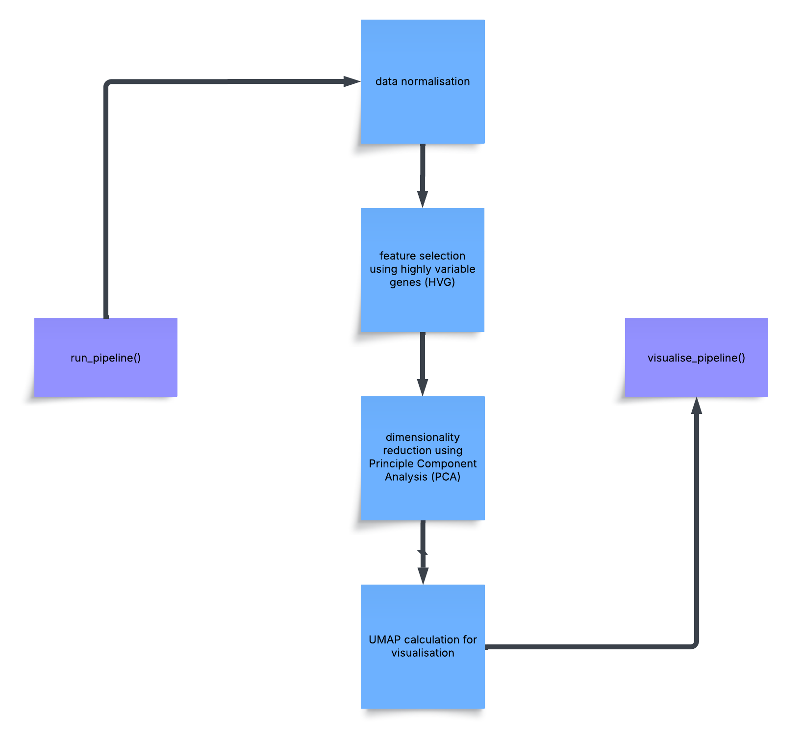

<!-- README.md is generated from README.Rmd. Please edit that file -->

# scPipeVis

<!-- badges: start -->

<!-- badges: end -->

Run scRNA-seq data analysis pipeline + visualization

## Description

Single cell RNA sequencing (scRNA-seq) is a genomic approach used to
quantify messenger RNA sequences (whole transcriptome) at the resolution
of a single cell, which can be scaled to tens of thousands of cells at
the same time. This results in generation of a cell by gene counts
matrix (in R gene by cell) as the primary data, and additional metadata
from any given scRNA-seq experiment. Data transformation, modelling, and
analysis methods operate downstream on the above described data.
`scPipeVis` is an R package that lets you perform all the steps with a
single function so users can download the package and run this function
to do a very preliminary bare-bones data analysis of scRNA-seq data.
Additionally there is a visualisation function that creates basic plots
which are typically used for the visualisation of scRNA-seq data. The
complete motivation behind the creation of this package follows. There
are major limitations of this package which are also talked about below.

### Motivation

A default single cell RNA sequencing data analysis pipeline comprises of
several steps, from quality control, normalization of count matrix,
feature selection, dimensionality reduction, clustering, annotating cell
types, and then differential gene expression followed by gene set
enrichment analysis. In my literature review, I found that all of these
steps can be performed in so many different ways by using different
methods at each step. This process is further complicated by tuning of
hyperparameters at many different steps. Therefore, any user while
analyzing their data, has to make so many choices/decisions at each
step. These decisions, like tuning the hyperparameter or choosing the
right method are absolutely not trivial. In other words, these choices
at each step can affect your downstream analyses. Therefore, making well
informed decisions are crucial. This is where scPipeVis comes in,
following an extensive literature review (Amezquita et al. 2019), I have
put together a pipeline that takes care of most of these above mentioned
steps using the current best practices methods based on published
reviews benchmarking different methods for all these steps. Further
scPipeVis provides a function to visualize each step of the pipeline
with many different and appropriate depictions. These depictions are
chosen after going through the literature and figuring out what kind of
visualizations are required at each step. Therefore, this part of the
package will facilitate informed decision making for users as they go on
to select the best suitable methods and hyper parameters which in turn
best suits their own datasets and meets their needs. The aim is to
reduce the initial decision burden and provide a starting point for
further, more specialised analyses.

### Limitations of `scPipeVis`

This package is created for preliminary data analysis of scRNA-seq data,
at the end of the day the user will have to eventually figure out if
certain methods work better to answer the question that they are trying
to answer using their data. The user will also eventually have to tune
hyperparameters of certain functions, if they dont get satisfactory
results from this pipeline. Last but not the least, here I don’t provide
an exhaustive set of visualizations. I will continue working on the
package to add more and more visualizations and make the pipeline more
end to end.

`scPipeVis` package was developed using `R version 4.5.1 (2025-06-13)`,
`Platform: aarch64-apple-darwin20` and
`Running under: macOS Sonoma 14.3`

## Installation

To install the latest version of scPipeVis:

``` r
install.packages("devtools")
library("devtools")
devtools::install_github("ArhanUofT/scPipeVis", build_vignettes = TRUE)
library("scPipeVis")
```

To run the Shiny app:

``` r
run_scPipeVis_app()
```

## Overview

``` r
ls("package:scPipeVis")
browseVignettes("scPipeVis")
```

`scPipeVis` currently provides four main user-facing functions:

- **`run_pipeline()`**  

  Run a standard scRNA-seq analysis pipeline on a `SingleCellExperiment`
  object. The pipeline includes quality control metrics,
  log-normalisation, highly variable gene selection, PCA, UMAP, and
  graph-based clustering, with results stored back into the
  `SingleCellExperiment`.

- **`visualise_pipeline()`**  

  Generate diagnostic plots summarising major pipeline steps, including
  the mean–variance relationship used for feature selection,
  low-dimensional embeddings (PCA and UMAP), QC distributions, and
  simple cluster-level summaries. Plots are returned as a named list of
  `ggplot` objects and are also combined and saved as a single
  multi-panel figure.

- **`plot_gene_on_umap()`**  

  Visualise expression of a single gene on the UMAP embedding using a
  viridis colour scale. This is useful for quick marker gene
  exploration. This can be useful for manual annotations or validating
  cluster annotations using marker genes.

- **`run_scPipeVis_app()`**  

  Launch an interactive Shiny app which runs the pipeline (if needed)
  and allows the user to select any gene and visualise its expression on
  the UMAP embedding via a simple graphical interface.

Refer to package vignettes for more details. An overview of the package
is illustrated below.  


## Contributions

- `scPipeVis` was developed by Arhan Rupani, 4th year Bioinformatics and
  Computational Biology student at the University of Toronto. The author
  did an extensive literature review to develop a basic understanding of
  the field of scRNA-seq data analysis and created this pipeline.
- The `run_pipeline` function was written by the author and runs a
  typical scRNA-seq pipeline given the counts matrix/data in a
  `SingleCellExperiment` object. The `visualise_pipeline` fucntion was
  written by the author and creates typical plots which are used during
  exploratory scRNA-seq data analysis. The `plot_gene_on_umap` function
  was written by the author and is inspired by the need to regularly
  visualise expression of marker genes after clustering for manual
  annotations or checking annotations. This function was originally
  needed for the authors other research project and found its way into
  this package. The shiny app is mainly build around this function as it
  makes for a perfect use case for the shiny app. All the functions make
  use of functions implemented in already existing R packages made for
  scRNA-seq data analysis. These packages are mentioned below and their
  full references are in the References section below.
- Packages used: SingleCellExperiment (Lun et al. 2016), scuttle
  (McCarthy et al. 2017), scater (McCarthy et al. 2017), scran (Lun et
  al. 2016), S4Vectors, ggplot2
- Generative AI was used for assignment 5 for coding help only. However,
  generative AI was not used until assignment 4 and the descison to use
  it in assignment 5 was made to not be at a disadvantage compared to
  other students in the class.

## References

- Amezquita RA, Lun ATL, Becht E, Carey VJ, Carpp LN, Geistlinger L,
  Marini F, Rue-Albrecht K, Risso D, Soneson C, et al. 2019 Dec 2.
  Orchestrating single-cell analysis with Bioconductor. Nature Methods.
  <doi:https://doi.org/10.1038/s41592-019-0654-x>.
- Hadley Wickham. 2016. ggplot2 Elegant Graphics for Data Analysis. Cham
  Springer International Publishing.
- Hadley Wickham. 2019. Advanced R. Boca Raton: Chapman & Hall/Crc.
- Lun ATL, McCarthy DJ, Marioni JC. 2016. A step-by-step workflow for
  low-level analysis of single-cell RNA-seq data with Bioconductor.
  F1000Research. 5:2122.
  <doi:https://doi.org/10.12688/f1000research.9501.2>.
- McCarthy DJ, Campbell KR, Lun ATL, Wills QF. 2017 Jan 14. Scater:
  pre-processing, quality control, normalization and visualization of
  single-cell RNA-seq data in R. Bioinformatics.:btw777.
  <doi:https://doi.org/10.1093/bioinformatics/btw777>.
- Risso D, Cole M (2025). scRNAseq: Collection of Public Single-Cell
  RNA-Seq Datasets. <doi:10.18129/B9.bioc.scRNAseq>, R package version
  2.23.1, <https://bioconductor.org/packages/scRNAseq>.
- Wickham H. 2015. R Packages. “O’Reilly Media, Inc.”
- Slides for BCB410 by professor Anjali Silva

## Acknowledgements

This package was developed as part of an assessment for 2025 BCB410H:
Applied Bioinformatics course at the University of Toronto, Toronto,
CANADA. `scPipeVis` welcomes issues, enhancement requests, and other
contributions. To submit an issue, use the GitHub issues.
